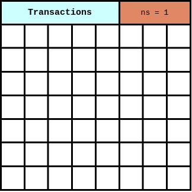
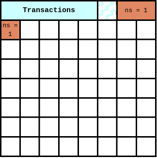
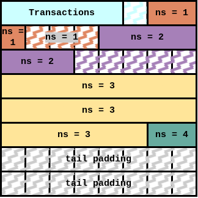

# ADR 003: Non-interactive Defaults, Wrapped Transactions, and Subtree Root Message Inclusion Checks

## Intro

Currently, when checking for message inclusion, validators recreate the share commitment from the messages in the block and compare those with what are signed over in the `MsgPayForData` transactions also in that block. If any commitment is not found in one of the PFD transactions, or if there is a commitment that doesn't have a corresponding message, then they reject that block.

While this functions as a message inclusion check, the light client has to assume that 2/3's of the voting power is honest in order to be assured that both the messages they are interested in and the rest of the messages paid for in that block are actually included.

To fix this, the spec outlines the “non-interactive default rules”. These involve a few additional message layout rules that allow for commitments to messages to consist entirely of sub tree roots of the data root, and for those sub tree roots to be generated only from the message itself (so that the user can sign something “non-interactively”). NOTE: MODIFIED FROM THE SPEC

- Messages begin at a location aligned with the largest power of 2 that is not larger than the message length or k.
- If the largest power of 2 of a given message spans multiple rows it must begin at the start of a row (this can occur if a message is longer than k shares or if the block producer decides to start a message partway through a row and it cannot fit).

We can always create a commitment to the data that is a subtree root of the data root while only knowing the data in that message. Below illustrates how we can break a message up into two different subtree roots, the first for first four shares, the second consisting of the last two shares.

In practice this means that we end up adding padding between messages (zig-zag hatched share). Padding consists of a the namespace of the message before it, with all zeros for data.

Not only does doing this allow for easy trust minimized message inclusion checks for specific messages by light clients, but also allows for the creation of message inclusion fraud proofs for all messages in the block. 

## Alternative Approaches

Arranging the messages in the block to maximize for fees is an NP-hard problem because each change to the square potentially affects the rest of the messages in the square. There will likely be many different strategies we could use to quickly and efficiently fill the square in a valid way.

## Decision

## Detailed Design

## Status

{Deprecated|Proposed|Accepted|Declined}

## Consequences

### Positive

### Negative

### Neutral

## References
