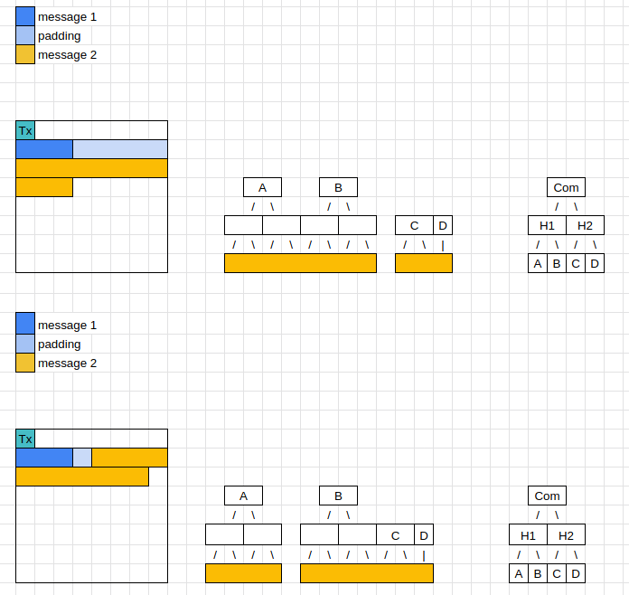
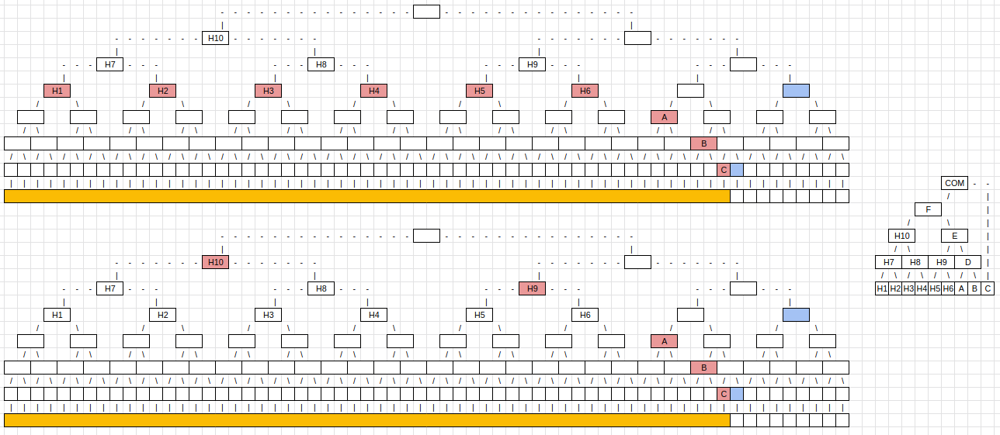
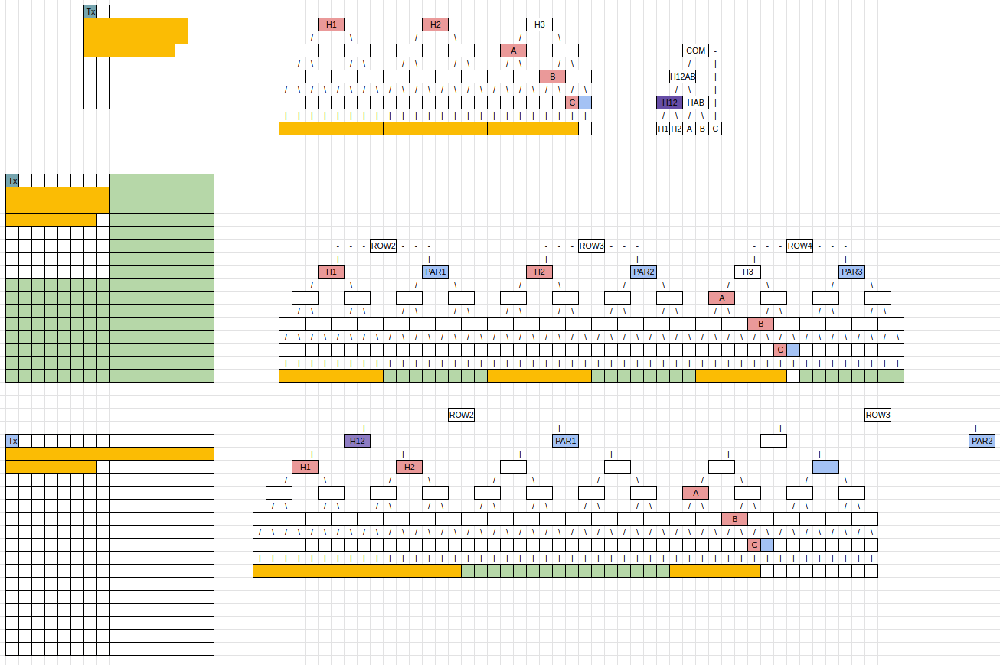
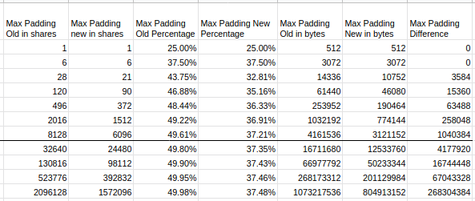

# ADR 009: New Non-Interactive Default Rules for Reduced Padding

## Changelog

- 14.11.2022: Initial Draft

## Context

 Is it worth it to change non-interactive default rules as a follow-up of [ADR 008](./adr-008-square-size-independent-message-commitments.md)  to decrease the padding? The downside is that the message inclusion proof size will not be as efficient in big square sizes.

- Inter-message padding can be reduced if we can change the non-interactive default rules from this:

    > - Messages that span multiple rows must begin at the start of a row (this can occur if a message is longer than k shares or if the block producer decides to start a message partway through a row and it cannot fit).
    > - Messages begin at a location aligned with the largest power of 2 that is not larger than the message length or k.

    To this: **Messages start at an index that is a multiple of its `msgMinSquareSize`.**

    As an example, we have this diagram. Message 1 is three shares long and is followed by message 2, which is 11 shares long, so the `msgMinSquareSize` of the second message is equal to four. Therefore we have a padding of 5 shares shown in light blue. Furthermore, with the new non-interactive default rule set, a message of size 11 can start in this block at index zero and index three because they are multiples of four. Therefore, we save four shares of padding while retaining the same commitment.

      

### Defining variables for this Analysis

- n:= Message length in number of shares
- k:= Square size
- r:= Number of rows a message fills in a Celestia square.

### The following Questions will be answered

- Why has a message in a bigger square size even with square size independent commitments O(log(n)) proof size?
- What is the worst-case constructible message in a square to have the biggest impact from switching from O(log(n)) to O(sqrt(n))?
- Why can we not use the same trick that we used in Question 1 in a single row for more efficient proofs over the row roots?
- How big is the proof size for this message?
- What is the worst constructible block with the most amount of padding with old and new non-interactive defaults?
- Quantify padding and proof size cost.

## Why has a message in a bigger square size even with square size independent commitments O(log(n)) proof size?

If you use the old NI-Rules then the message begins at a location aligned with the largest power of 2 that is not larger than the message length or k. Because the subtree roots are aligned you can skip some subtree roots and calculate their parents.
In the example below instead of proving H1, H2, H3, and H4 to the DataRoot you can prove H10. **H10 is part of the commitment generation and part of the Merkle tree to the DataRoot.** That is why you can use it for more efficient proofs. In smaller square sizes, you cannot do this, because H10 does not exist. The nodes in **red** are the subtree nodes that you need to provide for the message inclusion proof. The nodes in **blue** are the additional nodes for the Merkle proof.

So why can you not do it with the new NI-Rules? This is because H10 is not generated. In the diagram below the first 8 shares are in the row before and therefore the tree structure changes. The previous subtree root H10 is now H23 and cannot be used for the efficiency boost.
The commitment is still the same but we need to use the bottom subtree roots for the message inclusion proof.

## 2. What is the worst-case constructible message in a square to have the biggest impact from switching from O(log(n)) to O(sqrt(n))?

Given a square size k, the biggest message that you can construct that is affected by the new NI-Rules has a size (k/2)². If you construct a message that is bigger than (k/2)² the `minSquareSize` will be k. If the minSquareSize is k in a square of size k then the old NI-Rules are equivalent to the new NI-Rules, because the message starts always at the beginning of a row. In other words, if you have k² shares in a message the worst constructible message is a quarter of that k²/4, because that is the size of the next smaller square.

If you choose k²/4 as the worst constructible message it would still have O(sqrt(n)) subtree roots. This is because the size of the message is k²/4 with a width of k and a length of k/4. This means the number of rows the message fills approaches O(sqrt(n)). Therefore we need to find a message where the number of rows is log(n) of the size of the message.

With k being the square size and n being the number of shares and r being the number of rows, we want to find a message so that:
k * r = n & log(n) = r => k = n/log(n)

By substituting in k we can calculate n. To get r we calculate n/k, rounding up to the next highest integer in the processes.

|   k  |   n   |  r |
|:----:|:-----:|:--:|
|    2 |     4 |  2 |
|    4 |    16 |  4 |
|    8 |    43 |  6 |
|   16 |   108 |  7 |
|   32 |   256 |  8 |
|   64 |   589 | 10 |
|  128 |  1328 | 11 |
|  256 |  2951 | 12 |
|  512 |  6483 | 13 |
| 1024 | 14116 | 14 |
| 2048 | 30509 | 15 |

The worst case constructible message in a square to have the biggest impact from switching from O(log(n)) to O(sqrt(n)) with n being the size of the message, has r rows in a square size of k. If r is larger than k/4 we need to take k/4 as the number of rows instead because of the first point in this message. With adopting this rule the messages look as follows:

|   k  |   n   |  r |
|:----:|:-----:|:--:|
|    2 |     **2** |  **1** |
|    4 |     **4** |  **1** |
|    8 |    **16** |  **2** |
|   16 |    **64** |  **4** |
|   32 |   256 |  8 |
|   64 |   589 | 10 |
|  128 |  1328 | 11 |
|  256 |  2951 | 12 |
|  512 |  6483 | 13 |
| 1024 | 14116 | 14 |
| 2048 | 30509 | 15 |

 Reminder: We did this calculation because the rows need to be in O(log(n)) proof size.

## Why can we not use the same trick that we used in Question 1 in a single row for more efficient proofs over the row roots?

The node needs to be part of the commitment generation **and** part of the Merkle tree to the DataRoot for the trick to work. The diagram shows that the parent nodes connect the same nodes, but because of how Merkle trees are generated they are not the same. Therefore you cannot use those subtree roots as they are not included in the commitment.
In the example, H4 is a node over row roots, and H12 is a row root itself. They are generated differently. H4 cannot be used in the Merkle inclusion proof, because it is **not** part of the commitment generation. The parent node over the row roots is generated differently than the node of subtree roots.

## How big is the proof size for this message?

We differentiate the size of the proof between the Old NI-Rules and the new NI-Rules.

### Old Non-Interactive Default Rules

Each row consists of one subtree root, which means if you have log(n) rows you will have in total log(n) subtree roots. The last row has log(n) subtree roots. The last row will also need log(k) blue nodes. Blue nodes are additional nodes that you need for the Merkle proof, which have been used in the previous diagrams. After having now r row roots we need to a Merkle proof of them to the `DataRoot`.In the worst case, the message lies in the middle of the block. Therefore we will need 2* log(k) blue nodes for the proof.

Proofsize = log(n) + log(n) + log(k) + 2*log(k)

### New Non-Interactive Default Rules

Each row consists of O(sqrt(n)/log(n)) subtree roots. Which makes in total sqrt(n) subtree roots. The rest is here the same as before.

Proofsize = sqrt(n) + log(n) + log(k) + 2*log(k)

## What is the worst constructible block with the most amount of padding with old and new non-interactive default rules?

For the old NI-Rules, when you have a square size of k you can alternate messages of size k/2 +1 and k/4 +1 to have the most amount of padding. This forces you to always use a new row.
Padding = (k/2 -1) \* (k/2 -1) + (3k/4 -1) \* (k/2 -1)

To have the most amount of padding for the new NI-Rules you use repeated messages of size 5 which will result in a padding of 3 in between.
Padding = 3 \* (k-1) \* k/8

## Result

Proofsize increases from 3024 bytes to 10704 bytes in 2 GB blocks. In the current `MaxSquareSize` it's from 2064 to 3312 bytes. For bigger messages, the number of row roots will approach sqrt(n). Before that, we will get to k/4 roots which will make the message act the same before and after the new NI-Rules.

The worst-case padding decreases from 1.3 GB to 0.8 GB in 2 GB Blocks. In the current `MaxSquareSize` it's from 5 MB to 3 MB. In general, the worst-case padding size approaches in old NI-Rules 66% and the new NI-Rules 37.5%. That is a reduction of almost 50%.

## Status

Proposed

## Consequences

### Positive

The Padding decreases a lot.

### Negative

The Proof size increases a bit.

## References

[Related Question](https://github.com/celestiaorg/celestia-app/blob/main/docs/architecture/adr-008-square-size-independent-message-commitments.md#positive-celestia-app-changes)
