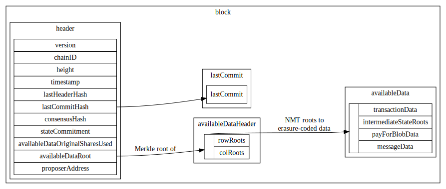
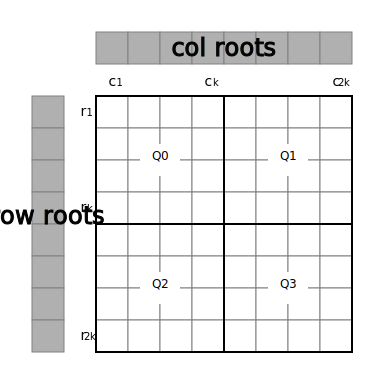
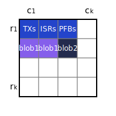

# Data Structures

<!-- toc -->

## Data Structures Overview



## Type Aliases

| name                        | type                        |
|-----------------------------|-----------------------------|
| `Amount`                    | `uint64`                    |
| `Graffiti`                  | `byte[MAX_GRAFFITI_BYTES]`  |
| [`HashDigest`](#hashdigest) | `byte[32]`                  |
| `Height`                    | `int64`                     |
| `Nonce`                     | `uint64`                    |
| `Round`                     | `int32`                     |
| `StateSubtreeID`            | `byte`                      |
| [`Timestamp`](#timestamp)   | `google.protobuf.Timestamp` |
| `VotingPower`               | `uint64`                    |

## Blockchain Data Structures

### Block

Blocks are the top-level data structure of the Celestia blockchain.

| name                  | type                                        | description                                                           |
|-----------------------|---------------------------------------------|-----------------------------------------------------------------------|
| `header`              | [Header](#header)                           | Block header. Contains primarily identification info and commitments. |
| `availableDataHeader` | [AvailableDataHeader](#availabledataheader) | Header of available data. Contains commitments to erasure-coded data. |
| `availableData`       | [AvailableData](#availabledata)             | Data that is erasure-coded for availability.                          |
| `lastCommit`          | [Commit](#commit)                           | Previous block's Tendermint commit.                                   |

### Header

Block header, which is fully downloaded by both full clients and light clients.

| name                              | type                                  | description                                                                                                                                                        |
|-----------------------------------|---------------------------------------|--------------------------------------------------------------------------------------------------------------------------------------------------------------------|
| `version`                         | [ConsensusVersion](#consensusversion) | The consensus version struct.                                                                                                                                      |
| `chainID`                         | `string`                              | The `CHAIN_ID`.                                                                                                                                                    |
| `height`                          | [Height](#type-aliases)               | Block height. The genesis block is at height `1`.                                                                                                                  |
| `timestamp`                       | [Timestamp](#timestamp)               | Timestamp of this block.                                                                                                                                           |
| `lastHeaderHash`                  | [HashDigest](#hashdigest)             | Previous block's header hash.                                                                                                                                      |
| `lastCommitHash`                  | [HashDigest](#hashdigest)             | Previous block's Tendermint commit hash.                                                                                                                           |
| `consensusHash`                   | [HashDigest](#hashdigest)             | Hash of [consensus parameters](#consensus-parameters) for this block.                                                                                              |
| `AppHash`                         | [HashDigest](#hashdigest)             | The [state root](#state) after the previous block's transactions are applied.                                                                                      |
| `availableDataOriginalSharesUsed` | `uint64`                              | The number of shares used in the [original data square](#arranging-available-data-into-shares) that are not [tail padding](./consensus.md#reserved-namespace-ids). |
| `availableDataRoot`               | [HashDigest](#hashdigest)             | Root of [commitments to erasure-coded data](#availabledataheader).                                                                                                 |
| `proposerAddress`                 | [Address](#address)                   | Address of this block's proposer.                                                                                                                                  |

The size of the [original data square](#arranging-available-data-into-shares), `availableDataOriginalSquareSize`, isn't explicitly declared in the block header. Instead, it is implicitly computed as the smallest power of 2 whose square is at least `availableDataOriginalSharesUsed` (in other words, the smallest power of 4 that is at least `availableDataOriginalSharesUsed`).

The header hash is the [hash](#hashing) of the [serialized](#serialization) header.

### AvailableDataHeader

| name       | type                          | description                            |
|------------|-------------------------------|----------------------------------------|
| `rowRoots` | [HashDigest](#hashdigest)`[]` | Commitments to all erasure-coded data. |
| `colRoots` | [HashDigest](#hashdigest)`[]` | Commitments to all erasure-coded data. |

The number of row/column roots of the original data [shares](data_structures.md#share) in [square layout](#arranging-available-data-into-shares) for this block. The `availableDataRoot` of the [header](#header) is computed using the compact row and column roots as described [here](#2d-reed-solomon-encoding-scheme).

The number of row and column roots is each `availableDataOriginalSquareSize * 2`, and must be a power of 2. Note that the minimum `availableDataOriginalSquareSize` is 1 (not 0), therefore the number of row and column roots are each at least 2.

Implementations can prune rows containing only [tail padding](./consensus.md#reserved-namespace-ids) as they are implicitly available.

### AvailableData

Data that is [erasure-coded](#erasure-coding) for [data availability checks](https://arxiv.org/abs/1809.09044).

| name                        | type                                                    | description                                                                                                  |
|-----------------------------|---------------------------------------------------------|--------------------------------------------------------------------------------------------------------------|
| `transactionData`           | [TransactionData](#transactiondata)                     | Transaction data. Transactions modify the validator set and balances, and pay fees for blobs to be included. |
| `intermediateStateRootData` | [IntermediateStateRootData](#intermediatestaterootdata) | Intermediate state roots used for fraud proofs.                                                              |
| `payForBlobData`            | [PayForBlobData](#payforblobdata)                       | PayForBlob data. Transactions that pay for blobs to be included.                                             |
| `blobData`                  | [BlobData](#blobdata)                                   | Blob data. Blobs are app data.                                                                               |

### Commit

| name         | type                        | description                        |
|--------------|-----------------------------|------------------------------------|
| `height`     | [Height](#type-aliases)     | Block height.                      |
| `round`      | [Round](#type-aliases)      | Round. Incremented on view change. |
| `headerHash` | [HashDigest](#hashdigest)   | Header hash of the previous block. |
| `signatures` | [CommitSig](#commitsig)`[]` | List of signatures.                |

### Timestamp

Timestamp is a [type alias](#type-aliases).

Celestia uses [`google.protobuf.Timestamp`](https://developers.google.com/protocol-buffers/docs/reference/google.protobuf#google.protobuf.Timestamp) to represent time.

### HashDigest

HashDigest is a [type alias](#type-aliases).

Output of the [hashing](#hashing) function. Exactly 256 bits (32 bytes) long.

### TransactionFee

| name      | type     | description                        |
|-----------|----------|------------------------------------|
| `tipRate` | `uint64` | The tip rate for this transaction. |

Abstraction over transaction fees.

### Address

Celestia supports [secp256k1](https://en.bitcoin.it/wiki/Secp256k1) keys where [addresses](https://github.com/cosmos/cosmos-sdk/blob/main/docs/architecture/adr-028-public-key-addresses.md) are 20 bytes in length.

| name         | type       | description                                                             |
|--------------|------------|-------------------------------------------------------------------------|
| `AccAddress` | `[20]byte` | AccAddress a wrapper around bytes meant to represent an account address |

### CommitSig

```C++
enum CommitFlag : uint8_t {
    CommitFlagAbsent = 1,
    CommitFlagCommit = 2,
    CommitFlagNil = 3,
};
```

| name               | type                    | description |
|--------------------|-------------------------|-------------|
| `commitFlag`       | `CommitFlag`            |             |
| `validatorAddress` | [Address](#address)     |             |
| `timestamp`        | [Timestamp](#timestamp) |             |
| `signature`        | [Signature](#signature) |             |

### Signature

| name | type       | description                 |
|------|------------|-----------------------------|
| `r`  | `byte[32]` | `r` value of the signature. |
| `s`  | `byte[32]` | `s` value of signature.     |

## ConsensusVersion

| name    | type     | description          |
|---------|----------|----------------------|
| `block` | `uint64` | The `VERSION_BLOCK`. |
| `app`   | `uint64` | The `VERSION_APP`.   |

## Serialization

Objects that are committed to or signed over require a canonical serialization. This is done using a deterministic (and thus, bijective) variant of protobuf defined [here](https://github.com/cosmos/cosmos-sdk/blob/master/docs/architecture/adr-027-deterministic-protobuf-serialization.md).

Note: there are two requirements for a serialization scheme, should this need to be changed:

1. Must be bijective.
1. Serialization must include the length of dynamic structures (e.g. arrays with variable length).

## Hashing

<!-- disable markdown link check for doi.org because it frequently fails -->
<!-- markdown-link-check-disable -->
All protocol-level hashing is done using SHA-2-256 as defined in [FIPS 180-4](https://doi.org/10.6028/NIST.FIPS.180-4). SHA-2-256 outputs a digest that is 256 bits (i.e. 32 bytes) long.
<!-- markdown-link-check-enable -->

Libraries implementing SHA-2-256 are available in Go (<https://pkg.go.dev/crypto/sha256>) and Rust (<https://docs.rs/sha2>).

Unless otherwise indicated explicitly, objects are first [serialized](#serialization) before being hashed.

## Merkle Trees

Merkle trees are used to authenticate various pieces of data across the Celestia stack, including transactions, blobs, the validator set, etc. This section provides an overview of the different tree types used, and specifies how to construct them.

### Binary Merkle Tree

Binary Merkle trees are constructed in the same fashion as described in [Certificate Transparency (RFC-6962)](https://tools.ietf.org/html/rfc6962), except for using [a different hashing function](#hashing). Leaves are hashed once to get leaf node values and internal node values are the hash of the concatenation of their children (either leaf nodes or other internal nodes).

Nodes contain a single field:

| name | type                      | description |
|------|---------------------------|-------------|
| `v`  | [HashDigest](#hashdigest) | Node value. |

The base case (an empty tree) is defined as the [hash](#hashing) of the empty string:

```C++
node.v = 0xe3b0c44298fc1c149afbf4c8996fb92427ae41e4649b934ca495991b7852b855
```

For leaf node `node` of leaf data `d`:

```C++
node.v = h(0x00, serialize(d))
```

For internal node `node` with children `l` and `r`:

```C++
node.v = h(0x01, l.v, r.v)
```

Note that rather than duplicating the last node if there are an odd number of nodes (the [Bitcoin design](https://github.com/bitcoin/bitcoin/blob/5961b23898ee7c0af2626c46d5d70e80136578d3/src/consensus/merkle.cpp#L9-L43)), trees are allowed to be imbalanced. In other words, the height of each leaf may be different. For an example, see Section 2.1.3 of [Certificate Transparency (RFC-6962)](https://tools.ietf.org/html/rfc6962#section-2.1.3).

Leaves and internal nodes are hashed differently: the one-byte `0x00` is prepended for leaf nodes while `0x01` is prepended for internal nodes. This avoids a second-preimage attack [where internal nodes are presented as leaves](https://en.wikipedia.org/wiki/Merkle_tree#Second_preimage_attack) trees with leaves at different heights.

#### BinaryMerkleTreeInclusionProof

| name       | type                          | description                                                     |
|------------|-------------------------------|-----------------------------------------------------------------|
| `siblings` | [HashDigest](#hashdigest)`[]` | Sibling hash values, ordered starting from the leaf's neighbor. |

A proof for a leaf in a [binary Merkle tree](#binary-merkle-tree), as per Section 2.1.1 of [Certificate Transparency (RFC-6962)](https://tools.ietf.org/html/rfc6962#section-2.1.1).

### Namespace Merkle Tree

[Shares](./shares.md) in Celestia are associated with a provided _namespace_. The Namespace Merkle Tree (NMT) is a variation of the [Merkle Interval Tree](https://eprint.iacr.org/2018/642), which is itself an extension of the [Merkle Sum Tree](https://bitcointalk.org/index.php?topic=845978.0). It allows for compact proofs around the inclusion or exclusion of shares with particular namespace IDs.

Nodes contain three fields:

| name    | type                        | description                                   |
|---------|-----------------------------|-----------------------------------------------|
| `n_min` | [Namespace](./namespace.md) | Min namespace in subtree rooted at this node. |
| `n_max` | [Namespace](./namespace.md) | Max namespace in subtree rooted at this node. |
| `v`     | [HashDigest](#hashdigest)   | Node value.                                   |

The base case (an empty tree) is defined as:

```C++
node.n_min = 0x0000000000000000
node.n_max = 0x0000000000000000
node.v = 0xe3b0c44298fc1c149afbf4c8996fb92427ae41e4649b934ca495991b7852b855
```

For leaf node `node` of [share](./shares.md) data `d`:

```C++
node.n_min = d.namespace
node.n_max = d.namespace
node.v = h(0x00, d.namespace, d.rawData)
```

The `namespace` blob field here is the namespace of the leaf, which is a [`NAMESPACE_SIZE`](consensus.md#system-parameters)-long byte array.

Leaves in an NMT **must** be lexicographically sorted by namespace in ascending order.

For internal node `node` with children `l` and `r`:

```C++
node.n_min = min(l.n_min, r.n_min)
if l.n_min == PARITY_SHARE_NAMESPACE
  node.n_max = PARITY_SHARE_NAMESPACE
else if r.n_min == PARITY_SHARE_NAMESPACE
  node.n_max = l.n_max
else
  node.n_max = max(l.n_max, r.n_max)
node.v = h(0x01, l.n_min, l.n_max, l.v, r.n_min, r.n_max, r.v)
```

Note that the above snippet leverages the property that leaves are sorted by namespace: if `l.n_min` is [`PARITY_SHARE_NAMESPACE`](consensus.md#reserved-state-subtree-ids), so must `{l,r}.n_max`. By construction, either both the min and max namespace of a node will be [`PARITY_SHARE_NAMESPACE`](consensus.md#reserved-state-subtree-ids), or neither will: if `r.n_min` is [`PARITY_SHARE_NAMESPACE`](consensus.md#reserved-state-subtree-ids), so must `r.n_max`.

For some intuition: the min and max namespace for subtree roots with at least one non-parity leaf (which includes the root of an NMT, as [the right half of an NMT as used in Celestia will be parity shares](#2d-reed-solomon-encoding-scheme)) _ignore_ the namespace ID for the parity leaves. Subtree roots with _only parity leaves_ have their min and max namespace ID set to [`PARITY_SHARE_NAMESPACE`](consensus.md#reserved-state-subtree-ids). This allows for shorter proofs into the tree than if the namespace ID of parity shares was not ignored (which would cause the max namespace ID of the root to always be [`PARITY_SHARE_NAMESPACE`](consensus.md#reserved-state-subtree-ids)).

A compact commitment can be computed by taking the [hash](#hashing) of the [serialized](#serialization) root node.

#### NamespaceMerkleTreeInclusionProof

| name            | type                            | description                                                     |
|-----------------|---------------------------------|-----------------------------------------------------------------|
| `siblingValues` | [HashDigest](#hashdigest)`[]`   | Sibling hash values, ordered starting from the leaf's neighbor. |
| `siblingMins`   | [Namespace](./namespace.md)`[]` | Sibling min namespace IDs.                                      |
| `siblingMaxes`  | [Namespace](./namespace.md)`[]` | Sibling max namespace IDs.                                      |

When verifying an NMT proof, the root hash is checked by reconstructing the root node `root_node` with the computed `root_node.v` (computed as with a [plain Merkle proof](#binarymerkletreeinclusionproof)) and the provided `rootNamespaceMin` and `rootNamespaceMax` as the `root_node.n_min` and `root_node.n_max`, respectively.

## Erasure Coding

In order to enable trust-minimized light clients (i.e. light clients that do not rely on an honest majority of validating state assumption), it is critical that light clients can determine whether the data in each block is _available_ or not, without downloading the whole block itself. The technique used here was formally described in the paper [Fraud and Data Availability Proofs: Maximising Light Client Security and Scaling Blockchains with Dishonest Majorities](https://arxiv.org/abs/1809.09044).

The remainder of the subsections below specify the [2D Reed-Solomon erasure coding scheme](#2d-reed-solomon-encoding-scheme) used, along with the format of [shares](./shares.md) and how [available data](#available-data) is arranged into shares.

### Reed-Solomon Erasure Coding

Note that while data is laid out in a two-dimensional square, rows and columns are erasure coded using a standard one-dimensional encoding.

Reed-Solomon erasure coding is used as the underlying coding scheme. The parameters are:

- 16-bit Galois field
- [`availableDataOriginalSquareSize`](#header) original pieces (maximum of [`AVAILABLE_DATA_ORIGINAL_SQUARE_MAX`](./consensus.md#constants))
- [`availableDataOriginalSquareSize`](#header) parity pieces (maximum of [`AVAILABLE_DATA_ORIGINAL_SQUARE_MAX`](./consensus.md#constants)) (i.e `availableDataOriginalSquareSize * 2` total pieces), for an erasure efficiency of 50%. In other words, any 50% of the pieces from the `availableDataOriginalSquareSize * 2` total pieces are enough to recover the original data.
- [`SHARE_SIZE`](./consensus.md#constants) bytes per piece

Note that [`availableDataOriginalSquareSize`](#header) may vary each block, and [is decided by the block proposer of that block](./block_proposer.md#deciding-on-a-block-size). [Leopard-RS](https://github.com/catid/leopard) is a C library that implements the above scheme with quasilinear runtime.

### 2D Reed-Solomon Encoding Scheme

The 2-dimensional data layout is described in this section. The roots of [NMTs](#namespace-merkle-tree) for each row and column across four quadrants of data in a `2k * 2k` matrix of shares, `Q0` to `Q3` (shown below), must be computed. In other words, `2k` row roots and `2k` column roots must be computed. The row and column roots are stored in the `availableDataCommitments` of the [AvailableDataHeader](#availabledataheader).



The data of `Q0` is the original data, and the remaining quadrants are parity data. Setting `k = availableDataOriginalSquareSize`, the original data first must be split into [shares](./shares.md) and [arranged into a `k * k` matrix](#arranging-available-data-into-shares). Then the parity data can be computed.

Where `A -> B` indicates that `B` is computed using [erasure coding](#reed-solomon-erasure-coding) from `A`:

- `Q0 -> Q1` for each row in `Q0` and `Q1`
- `Q0 -> Q2` for each column in `Q0` and `Q2`
- `Q2 -> Q3` for each row in `Q2` and `Q3`

Note that the parity data in `Q3` will be identical if it is vertically extended from `Q1` or horizontally extended from `Q2`.


As an example, the parity data in the second column of `Q2` (in striped purple) is computed by [extending](#reed-solomon-erasure-coding) the original data in the second column of `Q0` (in solid blue).


Now that all four quadrants of the `2k * 2k` matrix are filled, the row and column roots can be computed. To do so, each row/column is used as the leaves of a [NMT](#namespace-merkle-tree), for which the compact root is computed (i.e. an extra hash operation over the NMT root is used to produce a single [HashDigest](#hashdigest)). In this example, the fourth row root value is computed as the NMT root of the fourth row of `Q0` and the fourth row of `Q1` as leaves.


Finally, the `availableDataRoot` of the block [Header](#header) is computed as the Merkle root of the [binary Merkle tree](#binary-merkle-tree) with the row and column roots as leaves, in that order.


### Arranging Available Data Into Shares

The previous sections described how some original data, arranged into a `k * k` matrix, can be extended into a `2k * 2k` matrix and committed to with NMT roots. This section specifies how [available data](#available-data) (which includes [transactions](#transactiondata), [intermediate state roots](#intermediatestaterootdata), PayForBlob transactions, and [blobs](#blobdata)) is arranged into the matrix in the first place.

Then,

1. For each of `transactionData`, `intermediateStateRootData`, PayForBlob transactions, [serialize](#serialization):
    1. For each request in the list:
        1. [Serialize](#serialization) the request (individually).
        1. Compute the length of each serialized request, [serialize the length](#serialization), and pre-pend the serialized request with its serialized length.
    1. Split up the length/request pairs into [`SHARE_SIZE`](./consensus.md#constants)`-`[`NAMESPACE_ID_BYTES`](./consensus.md#constants)`-`[`SHARE_RESERVED_BYTES`](./consensus.md#constants)-byte chunks.
    1. Create a [share](./shares.md) out of each chunk. This data has a _reserved_ namespace ID, so the first [`NAMESPACE_SIZE`](./consensus.md#constants)`+`[`SHARE_RESERVED_BYTES`](./consensus.md#constants) bytes for these shares must be set specially.
1. Concatenate the lists of shares in the order: transactions, intermediate state roots, PayForBlob transactions.

Note that by construction, each share only has a single namespace, and that the list of concatenated shares is [lexicographically ordered by namespace ID](consensus.md#reserved-namespace-ids).

These shares are arranged in the [first quadrant](#2d-reed-solomon-encoding-scheme) (`Q0`) of the `availableDataOriginalSquareSize*2 * availableDataOriginalSquareSize*2` available data matrix in _row-major_ order. In the example below, each reserved data element takes up exactly one share.


Each blob in the list `blobData`:

1. [Serialize](#serialization) the blob (individually).
1. Compute the length of each serialized blob, [serialize the length](#serialization), and pre-pend the serialized blob with its serialized length.
1. Split up the length/blob pairs into [`SHARE_SIZE`](./consensus.md#constants)`-`[`NAMESPACE_SIZE`](./consensus.md#constants)-byte chunks.
1. Create a [share](./shares.md) out of each chunk. The first [`NAMESPACE_SIZE`](./consensus.md#constants) bytes for these shares is set to the namespace.

For each blob, it is placed in the available data matrix, with row-major order, as follows:

1. Place the first share of the blob at the next unused location in the matrix, then place the remaining shares in the following locations.

Transactions [must commit to a Merkle root of a list of hashes](#transaction) that are each guaranteed (assuming the block is valid) to be subtree roots in one or more of the row NMTs. For additional info, see [the rationale document](../specs/data_square_layout.md) for this section.

However, with only the rule above, interaction between the block producer and transaction sender may be required to compute a commitment to the blob the transaction sender can sign over. To remove interaction, blobs can optionally be laid out using a non-interactive default:

1. Place the first share of the blob at the next unused location in the matrix whose column is aligned with the largest power of 2 that is not larger than the blob length or [`availableDataOriginalSquareSize`](#header), then place the remaining shares in the following locations **unless** there are insufficient unused locations in the row.
1. If there are insufficient unused locations in the row, place the first share of the blob at the first column of the next row. Then place the remaining shares in the following locations. By construction, any blob whose length is greater than [`availableDataOriginalSquareSize`](#header) will be placed in this way.

In the example below, two blobs (of lengths 2 and 1, respectively) are placed using the aforementioned default non-interactive rules.



The blob share commitment rules may introduce empty shares that do not belong to any blob (in the example above, the top-right share is empty). These are zeroes with namespace ID equal to the either [`TAIL_TRANSACTION_PADDING_NAMESPACE_ID`](./consensus.md#constants) if between a request with a reserved namespace ID and a blob, or the namespace ID of the previous blob if succeeded by a blob. See the [rationale doc](../specs/data_square_layout.md) for more info.

## Available Data

### TransactionData

| name                  | type                                          | description                   |
|-----------------------|-----------------------------------------------|-------------------------------|
| `wrappedTransactions` | [WrappedTransaction](#wrappedtransaction)`[]` | List of wrapped transactions. |

#### WrappedTransaction

Wrapped transactions include additional metadata by the block proposer that is committed to in the [available data matrix](#arranging-available-data-into-shares).

| name             | type                        | description                                                                                                                                                                                                                                                                                                     |
|------------------|-----------------------------|-----------------------------------------------------------------------------------------------------------------------------------------------------------------------------------------------------------------------------------------------------------------------------------------------------------------|
| `index`          | `uint64`                    | Index of this transaction in the list of wrapped transactions. This information is lost when splitting transactions into fixed-sized [shares](./shares.md), and needs to be re-added here for fraud proof support. Allows linking a transaction to an [intermediate state root](#wrappedintermediatestateroot). |
| `transaction`    | [Transaction](#transaction) | Actual transaction.                                                                                                                                                                                                                                                                                             |
| `blobStartIndex` | `uint64`                    | _Optional, only used if transaction pays for a blob or padding_. Share index (in row-major order) of first share of blob this transaction pays for. Needed for light verification of proper blob inclusion.                                                                                                     |

#### Transaction

Celestia transactions are Cosmos SDK [transactions](https://github.com/cosmos/cosmos-sdk/blob/v0.46.15/docs/core/transactions.md).

### PayForBlobData

### IntermediateStateRootData

| name                            | type                                                              | description                               |
|---------------------------------|-------------------------------------------------------------------|-------------------------------------------|
| `wrappedIntermediateStateRoots` | [WrappedIntermediateStateRoot](#wrappedintermediatestateroot)`[]` | List of wrapped intermediate state roots. |

#### WrappedIntermediateStateRoot

| name                    | type                                            | description                                                                                                                                                                                                                                                                                                                       |
|-------------------------|-------------------------------------------------|-----------------------------------------------------------------------------------------------------------------------------------------------------------------------------------------------------------------------------------------------------------------------------------------------------------------------------------|
| `index`                 | `uint64`                                        | Index of this intermediate state root in the list of intermediate state roots. This information is lost when splitting intermediate state roots into fixed-sized [shares](./shares.md), and needs to be re-added here for fraud proof support. Allows linking an intermediate state root to a [transaction](#wrappedtransaction). |
| `intermediateStateRoot` | [IntermediateStateRoot](#intermediatestateroot) | Intermediate state root. Used for fraud proofs.                                                                                                                                                                                                                                                                                   |

#### IntermediateStateRoot

| name   | type                      | description                                                                              |
|--------|---------------------------|------------------------------------------------------------------------------------------|
| `root` | [HashDigest](#hashdigest) | Root of intermediate state, which is composed of the global state and the validator set. |

### BlobData

| name    | type              | description    |
|---------|-------------------|----------------|
| `blobs` | [Blob](#blob)`[]` | List of blobs. |

#### Blob

| name          | type                         | description                |
|---------------|------------------------------|----------------------------|
| `namespaceID` | [NamespaceID](#type-aliases) | Namespace ID of this blob. |
| `rawData`     | `byte[]`                     | Raw blob bytes.            |

## State

The state of the Celestia chain is intentionally restricted to containing only account balances and the validator set metadata. Similar to other Cosmos SDK based chains, the state of the Celestia chain is maintained in a [multistore](https://github.com/cosmos/cosmos-sdk/blob/v0.46.15/docs/core/store.md#multistore). The root of the application state is committed to in the [block header](#header) via the `AppHash`.

## Consensus Parameters

Various [consensus parameters](consensus.md#system-parameters) are committed to in the block header, such as limits and constants.

| name                             | type                                  | description                               |
|----------------------------------|---------------------------------------|-------------------------------------------|
| `version`                        | [ConsensusVersion](#consensusversion) | The consensus version struct.             |
| `chainID`                        | `string`                              | The `CHAIN_ID`.                           |
| `shareSize`                      | `uint64`                              | The `SHARE_SIZE`.                         |
| `shareReservedBytes`             | `uint64`                              | The `SHARE_RESERVED_BYTES`.               |
| `availableDataOriginalSquareMax` | `uint64`                              | The `AVAILABLE_DATA_ORIGINAL_SQUARE_MAX`. |

In order to compute the `consensusHash` field in the [block header](#header), the above list of parameters is [hashed](#hashing).
